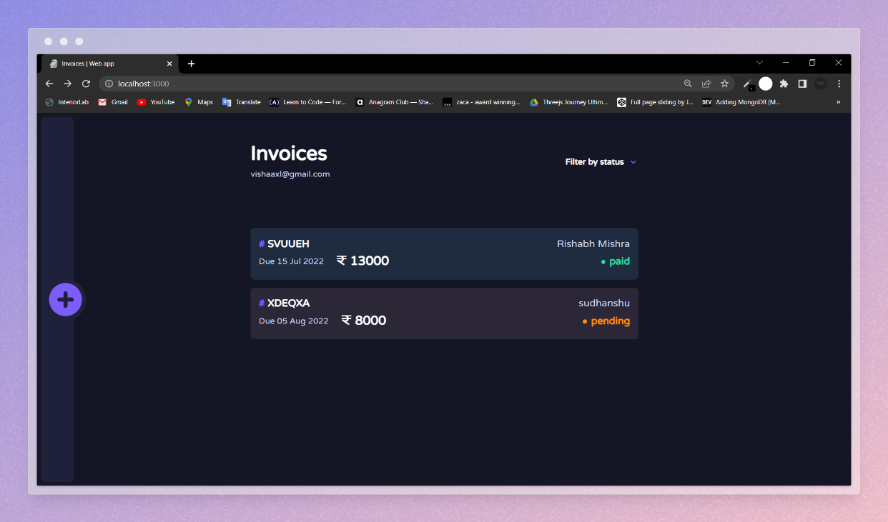
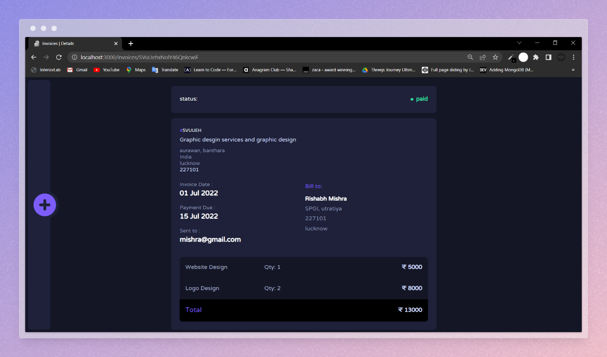

# Invoice App

# Introuction

Hi, there! 👋

This invoice app uses firebase firestore for managing invoives and nextjs for the front-end. You can login using your email Id and view, add, delete and update invoices.

## Overview

For this Web App, I've used

- React and Next.js with typescript (to build out the site)
- Tailwind css (to style it)
- Formik and Yup (to handle the forms in the site)
- Framer Motion (for the page transitions and animations)
- Next-auth (for authentication)
- day-js (for parsing dates) 😁

## How to get this project running locally

Clone this repository and run command `npm install` in your terminal. After downloading all the packages you need to create `.env.local` file and set CLIENT_ID, CLIENT_SECRET and NEXTAUTH_SECRET. You can get these from your google developer console. Don't forget to set authorized url redirects there. 🙂

After setting up everything you can run `npm run dev` to run in project in dev environment! 👍

## Things I Wish I Would Have Done

- Probably thought a little bit more about how to structure my styles before I started!
- Perhaps broken down a couple of large components a little more.
- And maybe used CSS variables to create the light/dark modes of the site (rather than styled-components' theme provider). I think it might have been a little... easier.

## Invoice details screen

Clicking on an Invoice will to take you to the detailed page where you can change status or delete invoice.

## Outro

I had a lot of learing and making this project. It still needs some code refactoring and bug fixes. Maybe I will fix them in future updates.

Happy invoicing 👋
